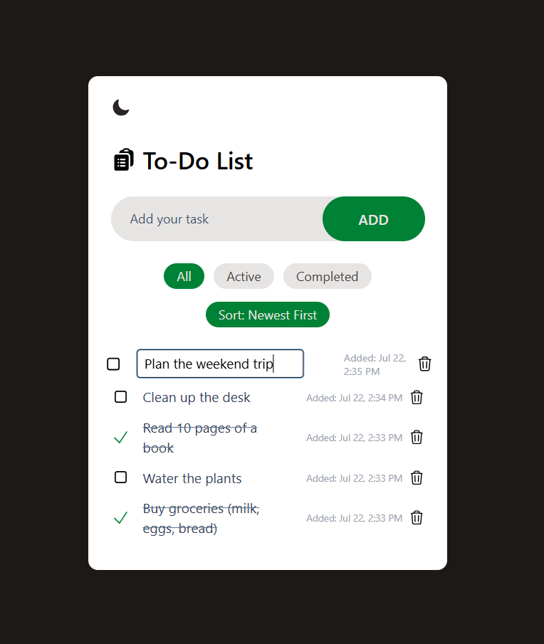
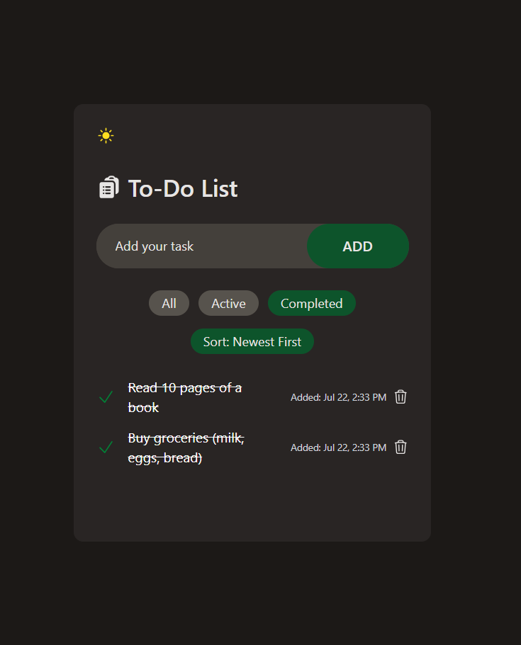

-- To-Do List App (React + Tailwind CSS) --

-- Project Overview -- 

A sleek, dark-mode enabled to-do list app built with React, styled using Tailwind CSS, and powered by Vite for lightning-fast performance.  
This project is built for portfolio-quality and includes advanced UI features, animations, and local data persistence.

-- Features --

=>  Add, complete, delete, and edit tasks
=>  Filter: All / Active / Completed
=>  Timestamps for each task
=>  Sort: Newest First / Oldest First
=>  Dark Mode toggle (with saved preference)
=>  Smooth entry animations using Tailwind CSS
=>  LocalStorage persistence
=>  Fully responsive layout

-- Screenshots --

Light Mode:

Dark Mode:

-- Tech Stack --

=> React
=> Vite
=> Tailwind CSS
=> LocalStorage
=> Heroicons
=> date-fns

-- Project Structure --

src/
components/     #(Todo.jsx, TodoItems.jsx)
layout/         #(AppTheme.jsx)
App.jsx/        #Root component

-- Getting Started --

git clone https://github.com/qendresahaqifi/todo-app.git
cd todo-app
npm install
npm run dev
